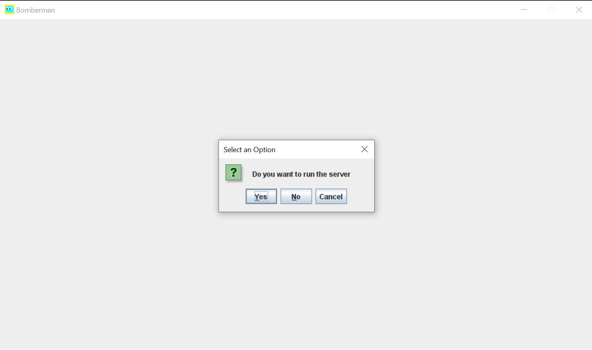

# Bomberman-2.0

## Navigation
- [Bomberman-2.0](#Bomberman-2.0)
    - [Description](#Description-)
    - [Assets](#Assets-)
    - [Sounds](#Sounds-)
    - [How to compile and run](#How_to_compile_and_run)
    - [How to play](#How_to_play)
    - [Credits](#Credits-)
## Description
- OOP class project.
- A better version of my [c++ Bomberman](https://github.com/Darthveloper21/Bomberman-UET)
- Just like the classic NES bomberman, we play as a character who has bombs as weapons.

## Assets
- Taken from various sources (I just google for them!)
- I draw the buttons, result scenes and floor.png myself.
- I make a formatted [file](./resources/map1.txt) for game map, you can create one for your own (Write a script for it is recommended).

## Sounds
- I google for sound effects.
- Music backgroud is [STRLGHT - Clutch](https://www.youtube.com/watch?v=z1vcJPKHJ3A).

## How to compile and run
- You need [JDK8](https://www.oracle.com/java/technologies/javase/javase-jdk8-downloads.html) (Java SE Development Kit 8) to compile and run java classes.
- To play online via localhost:
    
   First run the game, the game will ask you if you want to run the server. Click yes to host one. 
.  
   
   When another computer that also connects with localhost run the game, click "no" and both apps will automatically connected to each other. 
   Choose two players-online mode and enjoy the game.
        
   __Note: I haven't tried to run the third client (I dont have enough infrastructure to run and test that much clients 🙁) so it might crash if you try to__
        
## How to play
- In single mode: _WASD_ key for movement, _SPACE_ to set a bomb. You lose if an enemy touch you or you are in an explosion. 
    Red ghost has random movement 
    Blue ghost is smarter, it follow you every where if it is possible to find at least a path.
- In two players mode: 
    Offline: _WASD_ and _SPACE_ keys for Luigi. ⬆⬇⬅➡ and _P_ keys for Minotaur. 
    Online via localhost: Both are _WASD_ and _SPACE_ keys.
    
## Credit
- Made by [***@Darthveloper21***](https://github.com/Darthveloper21).
- This project is licensed under the [**MIT License**](https://choosealicense.com/licenses/mit).
